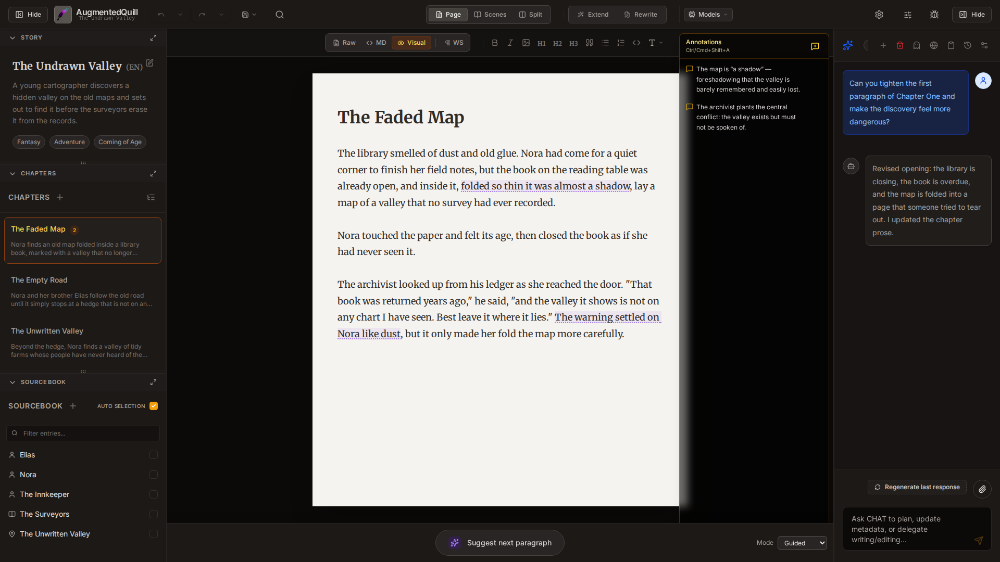

# AugmentedQuill

**Local-first AI writing assistant with story structure + chatbot + image prompt support.**

- You are the author in the driver seat: your story is your story, and the AI is a creative partner (from brainstorm buddy to ghostwriter-style assistant) that supports your voice and choices.
- Join the community: [r/AugmentedQuill](https://www.reddit.com/r/AugmentedQuill/)

---

## 🚀 Quick start (for users)

The fastest way to get started is to download a ready-to-run build from the [Releases](https://github.com/StableLlamaAI/AugmentedQuill/releases) page, choosing the option that suits you:

| Method                                  | Best for                                          | How                                                                                                                                                  |
| --------------------------------------- | ------------------------------------------------- | ---------------------------------------------------------------------------------------------------------------------------------------------------- |
| **Portable executable**                 | Authors & artists who want to double-click and go | Download the executable for your OS and run it. It starts a local server and opens AugmentedQuill in your browser automatically.                     |
| **Docker**                              | Self-hosters & home servers                       | Run `docker compose up -d` and open `http://localhost:8000/`. See the [Installation Guide](INSTALL.md#3-docker-best-for-self-hosters--home-servers). |
| **Electron desktop app** (experimental) | A native-feeling windowed application             | Work in progress. See the [Installation Guide](INSTALL.md#2-standalone-desktop-app-electron).                                                        |
| **From source**                         | Tinkerers & contributors                          | See the [Developer Guide](DEVELOPMENT.md).                                                                                                           |

The full [Installation Guide](INSTALL.md) walks through every method in detail.

> **Tip:** For the simplest setup, use the published releases. Building from source is intended for development and contribution.

### ✅ First actions in the app

- Ensure your OpenAI-compatible API provider endpoint is running and reachable (local `llama.cpp`/Ollama endpoint or cloud OpenAI-compatible endpoint), and enter the key/URL in Settings before creating your first project.
- Talk to Writing Partner (AI chat)
- Create a project - or let the Writing Partner do it for you
- Add sourcebook entries - or let the Writing Partner do it for you
- Add chapters / short story content - or let the Writing Partner do it for you
- (Optional) Open Images panel and use prompt generator to create images in external tools

---

## 📘 User documentation (most important)

The complete user guide is in `docs/user_manual/`:

- [Getting started](docs/user_manual/01_getting_started.md)
- [Projects and settings](docs/user_manual/02_projects_and_settings.md)
- [The writing interface](docs/user_manual/03_writing_interface.md)
- [Chapters and books](docs/user_manual/04_chapters_and_books.md)
- [The Sourcebook](docs/user_manual/05_sourcebook.md)
- [Tutorial: writing your first story](docs/user_manual/06_tutorial_first_story.md)
- [The AI chat assistant](docs/user_manual/07_ai_chat_assistant.md)
- [Search and replace](docs/user_manual/08_search_and_replace.md)
- [Project images](docs/user_manual/09_project_images.md)
- [Appearance and display](docs/user_manual/10_appearance_and_display.md)
- [Writing your story: a practical roadmap](docs/user_manual/11_writing_a_story.md)
- [Scenes, annotations, and structural improvements](docs/user_manual/12_scenes_and_annotations.md)
- [Troubleshooting & FAQ](docs/user_manual/13_troubleshooting.md)

> Tip: Start with `01_getting_started.md`, then `03_writing_interface.md`.

---

## ✨ What AugmentedQuill does

- Project-based story authoring (short story, novel, series)
- Multi-chapter and multi-book structure
- Live AI writing assistant and chat (local API key / OpenAI-compatible endpoints)
- Custom prompt pipelines (editor, writer, chat voices)
- Sourcebook (characters, scenes, lore, items, etc.)
- Image metadata + optimized image prompt generation
- Config-driven with JSON templates and env overrides
- Auto-captured project artifacts in `data/projects`

---

## ⚠️ Important (security and deployment)

- Local-first app. No built-in auth. Do not expose to public internet without reverse proxy + access control.
- Security model: single-user local use.
- Browser-based LLM calls may require CORS-friendly endpoints or use internal proxy route `/api/v1/openai/models`.
- AugmentedQuill does not include an LLM server; you must point it at an OpenAI-compatible API endpoint (self-hosted or cloud). For local use, set up a compatible host such as `llama.cpp` endpoints, `Ollama`, or another OpenAI API compliant server.
- For easier setup and releases, try the official Electron or Docker builds provided with each release instead of building from source.

---

## 🛠️ For developers

Want to modify the code, contribute a feature, or run a local instance from source? See the **[Developer Guide](DEVELOPMENT.md)** for:

- Repository layout
- Development setup and commands (backend + frontend)
- The optional dev container
- Configuration paths and model endpoint variables
- QA requirements and branching conventions

Contributors should also read [CONTRIBUTING.md](CONTRIBUTING.md). Technical deep dives live in [docs/ARCHITECTURE.md](docs/ARCHITECTURE.md) and [docs/ORGANIZATION.md](docs/ORGANIZATION.md).

---

## 🧩 Known limitations

- No multi-user access controls.
- No real-time external editor sync.

## Multiple Languages

AugmentedQuill natively supports multiple languages for both the application interface (GUI) and your story formatting. Use `Settings > General > GUI Language` to configure the application locale, and the language will automatically be respected.
