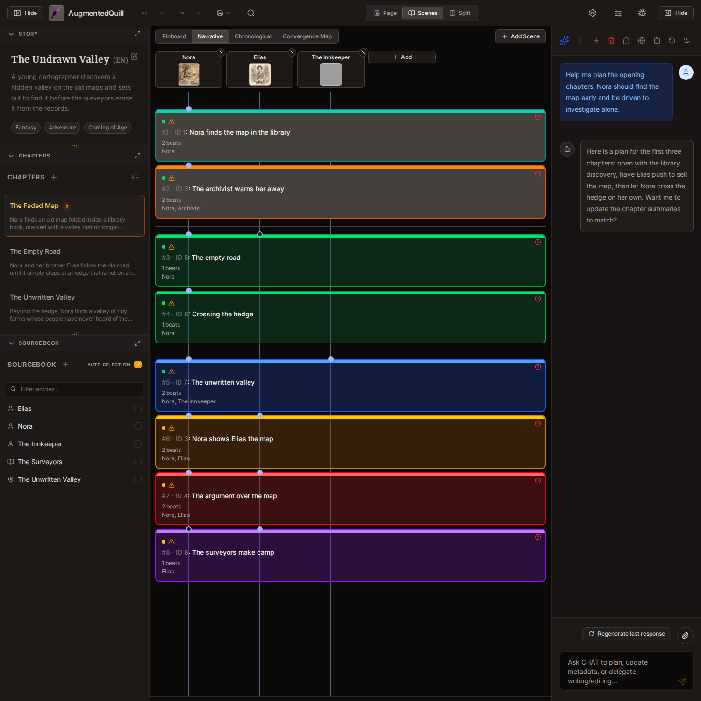
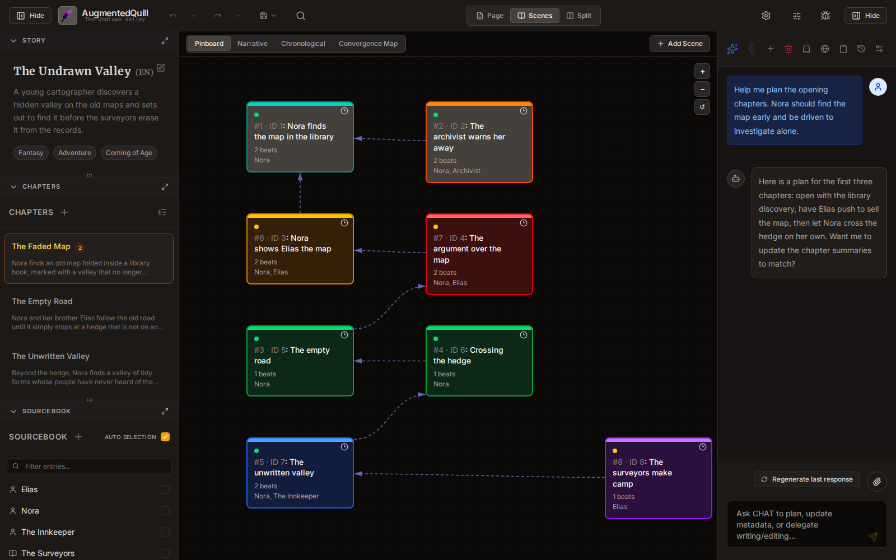
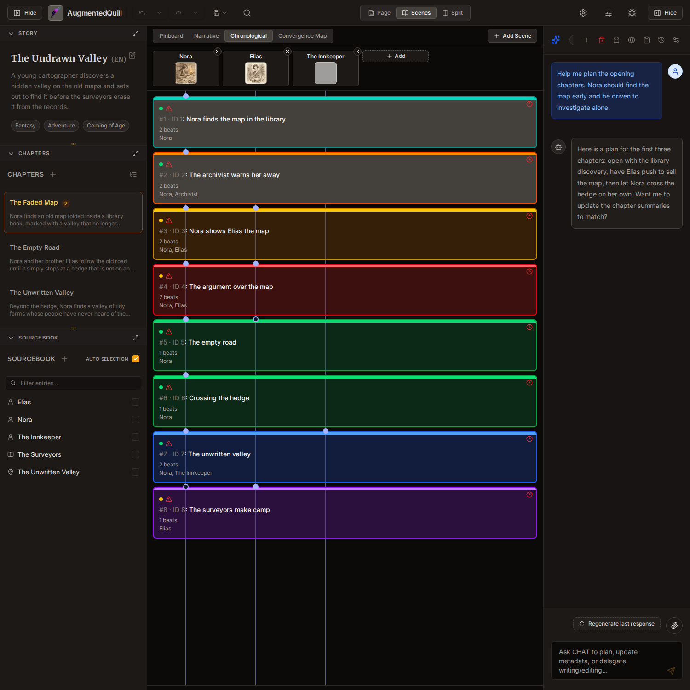
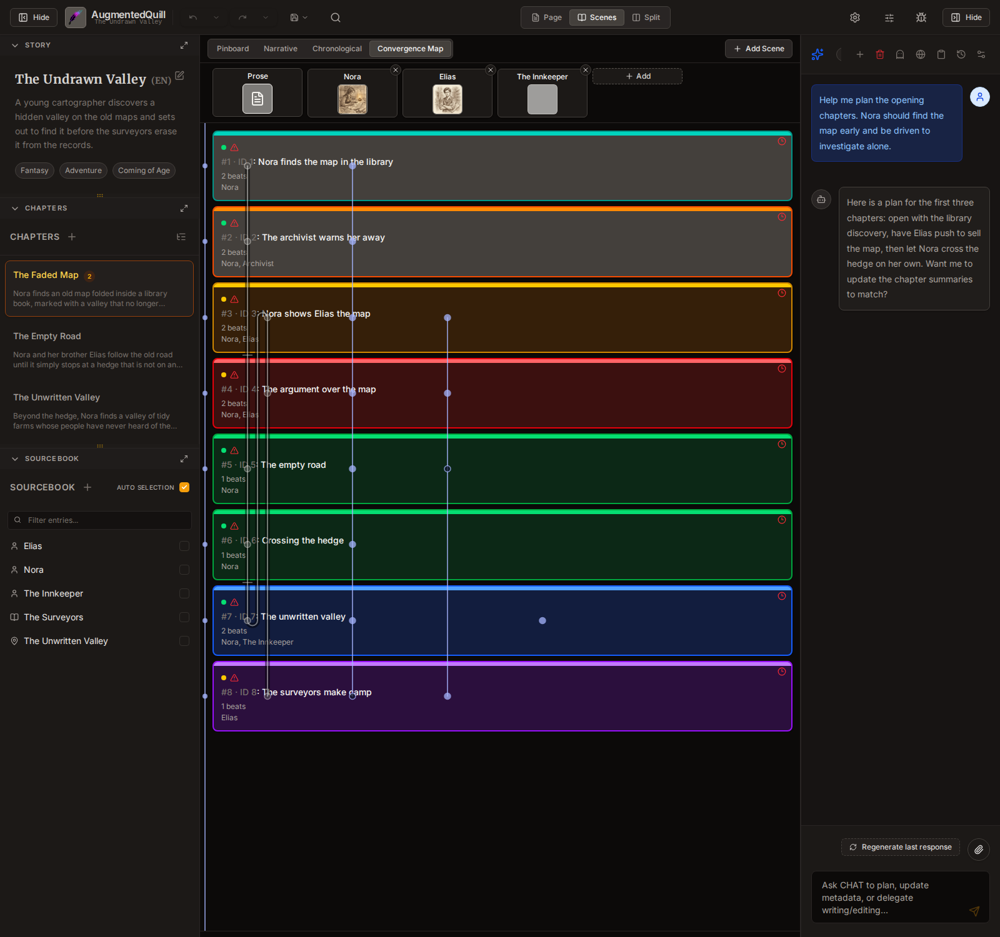
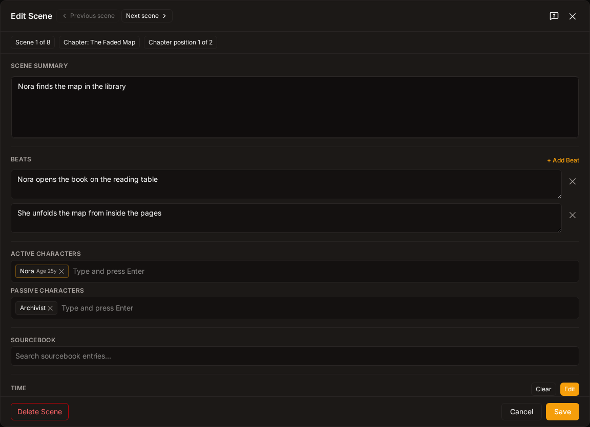
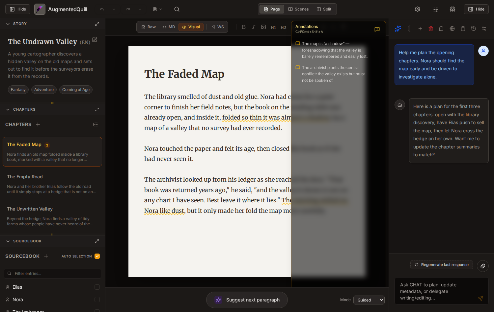

# Scenes, Annotations, and Structural Improvements

> **Introduced in:** v0.9+

This chapter covers the major new features: the **Scenes** system (for planning and structuring stories at the narrative-unit level), **inline Annotations** (for notes attached to specific prose), the **Convergence Map** (for time-travel and multi-timeline stories), and various other structural improvements.

---

## Table of Contents

1. [What Are Scenes?](#what-are-scenes)
2. [Workspace Modes](#workspace-modes)
3. [The Scenes Views](#the-scenes-views)
   - [Narrative View](#narrative-view)
   - [Pinboard View](#pinboard-view)
   - [Convergence Map](#convergence-map)
4. [Creating and Managing Scenes](#creating-and-managing-scenes)
   - [Scene Properties](#scene-properties)
   - [Causal Ordering](#causal-ordering)
   - [Scene Beats](#scene-beats)
5. [The Scene Editor Dialog](#the-scene-editor-dialog)
6. [Inline Annotations](#inline-annotations)
7. [Scene Sourcebook Tags](#scene-sourcebook-tags)
8. [Sidebar Enhancements](#sidebar-enhancements)
9. [Search and Replace in Scenes](#search-and-replace-in-scenes)
10. [AI Chat Integration](#ai-chat-integration)
11. [Diff Review Improvements](#diff-review-improvements)
12. [Sourcebook Time Travel Features](#sourcebook-time-travel-features)
13. [View State Persistence](#view-state-persistence)

---

## What Are Scenes?

A **Scene** is a narrative unit — a building block of your story that may span part of a chapter, an entire chapter, or remain unlinked from any prose (planning-only). Scenes allow you to:

- Plan your story's structure **before writing** any prose.
- Track **causal relationships** between story events (what causes what).
- Attach **sourcebook characters** to each scene.
- Assign **temporal** (date/time) and **location** metadata.
- Organize scenes into **timelines** for time-travel or parallel narratives.
- Visualize your story through multiple lenses: narrative order, free-form pinboard, or a convergence map with character arc snakes.

### Narrative Units vs. Prose

A scene is a **planning unit**, not a prose unit. Multiple scenes can exist within a single chapter, a scene can span multiple chapters, or a scene can exist purely as a plan without any prose attached. This separation lets you outline your story's structure independently of your actual writing.

---

## Workspace Modes

Click the **workspace mode buttons** in the top header bar to switch between layouts:

| Mode       | Icon       | What you see                                                 |
| ---------- | ---------- | ------------------------------------------------------------ |
| **Page**   | `FileText` | Traditional editor + left sidebar + right chat panel         |
| **Scenes** | `BookOpen` | Editor is replaced by the full Scenes panel                  |
| **Split**  | `Columns`  | Editor on the left, Scenes panel on the right — side by side |

---

## The Scenes Views

Once you're in **Scenes** or **Split** mode, use the segmented buttons labelled **Pinboard**, **Narrative**, **Chronological**, and **Convergence Map** to switch between view types.

> **In this screenshot:** the Scenes workspace in **Narrative** view. The view-mode buttons sit in the toolbar at the top, scene cards are grouped under their chapters, and arrows show which scenes cause which.

### Narrative View

The **Narrative View** (default) displays all scenes as a vertical list. Divider lines appear at chapter and book boundaries so you can see how scenes map onto your story structure.

- Scenes without any linked prose are collected at the bottom.
- **Click** any scene card to select it and highlight its prose in the editor.
- **Drag and drop** a scene card to reorder it (this adjusts the causal relationships).
- Multi-select: **Ctrl+click** to toggle individual scenes, **Shift+click** for range selection.

### Pinboard View

The **Pinboard View** provides an infinite canvas where you can freely position scene cards.

> **In this screenshot:** the **Pinboard** — cards are placed freely on the canvas and linked with causal arrows. Alt+drag from one card toward another draws a new arrow.

- **Pan:** Middle-mouse button drag, or **Alt+drag** on the background.
- **Zoom:** Scroll wheel.
- **Move cards:** Drag any card to reposition it.
- **Multi-card drag:** Drag one selected card to move all selected cards together.
- **Link scenes:** **Alt+drag** from one card toward another to draw a causal arrow — a ghost arrow preview appears as you drag.
- **Lasso select:** Drag on empty space to draw a selection rectangle.
- Same multi-select shortcuts as Narrative View (**Ctrl+click**, **Shift+click**).

### Chronological View

The **Chronological** view sorts every scene by its **in-story time** (the _Scene Time_ you set in the Scene Editor) rather than by narrative order. This is the fastest way to spot pacing problems, timeline conflicts, or scenes that are dated incorrectly.

> **In this screenshot:** the **Chronological** view — the same cards as the Narrative view, re-sorted by when each scene happens in the story, with scenes that share a time slot grouped together.

### Convergence Map

The **Convergence Map** is designed for **time-travel stories**. It shows scenes sorted by their in-story time, with one coloured snake path per sourcebook character drawn behind the cards.

> **In this screenshot:** the **Convergence Map**. Each character gets a coloured lane with a snake path that traces how they move through the story's timeline. When a character travels in time, the path doubles back as a U-turn.

- Each character or sourcebook entry gets its own **coloured lane** at the top.
- The snake shows the character's **experience order** through the story.
- Time-travel jumps appear as **U-turns** in the snake path.
- Scene cards are positioned by chronological story time, not narrative order.
- Click a character's lane button to highlight their path.

---

## Creating and Managing Scenes

### Creating a Scene

You can create scenes in several ways:

1. **AI Chat:** Ask the assistant to create a new scene (e.g., _"Create a new scene where Elena meets the stranger."_)
2. **Detect Boundaries:** Ask the AI to analyse your existing prose and **automatically detect scene boundaries**, creating linked scenes from the result.
3. **Write a Scene:** Ask the AI to write prose for a specific scene, optionally within a particular chapter.

### Scene Properties

Each scene card displays key information. You can edit all properties in the Scene Editor Dialog.

| Property               | Description                                                                                                            |
| ---------------------- | ---------------------------------------------------------------------------------------------------------------------- |
| **Summary**            | A one-line description of what happens in the scene.                                                                   |
| **Status**             | One of: Active, Draft, Completed, Paused, or Cut.                                                                      |
| **Location**           | Where the scene takes place (free text).                                                                               |
| **Time / Scene Time**  | When the scene takes place (date and time).                                                                            |
| **Timeline**           | Which timeline this scene belongs to. Default is "main"; for time-travel branches, you can create custom timeline IDs. |
| **Color Tag**          | A coloured border for visual organization — choose from red, orange, yellow, green, teal, blue, purple, or pink.       |
| **Active Characters**  | Characters who are present and active in the scene.                                                                    |
| **Passive Characters** | Characters who are present but not directly acting.                                                                    |
| **Causes**             | Which other scenes this one is caused by (determines narrative order).                                                 |

### Causal Ordering

Scenes are ordered by their **causal relationships**, not by arbitrary numbers. Each scene lists what it depends on, forming a cause-and-effect chain.

- The system automatically detects **ordering violations** — scenes that should logically come before the scenes that cause them — and shows an **`AlertTriangle` icon** on the card.
- **Temporal violations** are also flagged: if a scene's time is _before_ the scene that causes it, you'll see a **`Clock3` icon**.

### Scene Beats

Each scene can contain **Beats** — smaller sub-units of action within the scene. Beats help you break down a scene into its key moments (e.g., "Elena arrives", "The argument begins", "The stranger leaves") and can each link to their own section of prose.

---

## The Scene Editor Dialog

**Double-click** any scene card, or ask the AI to edit a scene, to open the **Scene Editor Dialog**. This provides a full form where you can:

> **In this screenshot:** the **Scene Editor** for one scene — summary, beats, active/passive characters, scene time, location, color tag, and causal links, all in a single form.

- Edit the **summary**, **location**, **time**, and **status**.
- Manage **Active** and **Passive character** lists.
- Assign a **color tag** for visual organization.
- Adjust the **pinboard position** (X/Y coordinates).
- View and edit **causal relationships** (which scenes this one follows or precedes).
- Set a **date/time** value by clicking the clock button to open the date/time picker.

---

## Inline Annotations

**Annotations** let you attach notes, comments, or reminders to specific ranges of text. They appear as coloured highlights in the editor.

> **In this screenshot:** two inline annotations highlighted in the prose, with the **Annotation panel** open on the right listing each comment. Click an entry to jump to its highlight in the text.

### Adding an Annotation

1. **Select** the text you want to annotate in the editor.
2. Press **Ctrl+Shift+A** (Windows/Linux) or **Cmd+Shift+A** (macOS) — or click the **`MessageSquare` icon** in the editor toolbar.
3. Type your comment in the dialog and confirm.

### Managing Annotations

Open the **Annotation Sidebar** (click the **`MessageSquarePlus` icon** in the right-side panel area). It lists all annotations for the current chapter:

- **Click** an annotation entry to scroll the editor to it and highlight the annotated range.
- Use the **`Pencil` icon** to edit a comment.
- Use the **`Trash2` icon** to delete an annotation.
- The list refreshes automatically when you switch chapters.

### Keyboard Shortcuts

| Shortcut                           | Action                             |
| ---------------------------------- | ---------------------------------- |
| **Ctrl+Shift+A** / **Cmd+Shift+A** | Create annotation on selected text |
| **Escape**                         | Close the annotation dialog        |

---

## Scene Sourcebook Tags

Characters and sourcebook entries can now carry a **birth or origin date**. When you attach such an entry to a scene, the system can display the character's **age** at the time of the scene, computed from their origin date and the scene's time.

### Per-Scene Personal Datetime Overrides

For time-travel stories, each character tag on a scene can optionally override the character's personal "now" for that specific scene. This allows the same character to appear multiple times in one scene (e.g., a time traveller meeting their younger self) — each instance can show a different age.

---

## Sidebar Enhancements

The left sidebar (containing Story, Chapters, and Sourcebook sections) received several improvements:

- **Resizable sections** — Drag the **`GripHorizontal` icon** (grip lines) between sections to resize them.
- **Section focus** — Click the **`Maximize2` icon** in a section's header to focus that section (it expands fully, collapsing others). Click the **`Minimize2` icon** to return to the multi-section view.
- **Scene tree in chapters** — Expand a chapter node to see its assigned scenes listed underneath in a compact tree view, using the **`ChevronRight` / `ChevronDown` icons** to expand and collapse.
- **Drag scenes onto chapters** — Drag a scene card from the scenes panel and drop it onto a chapter in the sidebar to link them.
- **Desktop behaviour** — On wide screens, selecting a chapter no longer closes the sidebar.

---

## Search and Replace in Scenes

The Search & Replace system (accessible via the AI chat or the search panel) can now search inside scene metadata:

- **Scene summaries** — Find and replace text in scene descriptions.
- **Scene locations** — Search or replace location names across all scenes.
- **Scene times** — Find temporal values.
- **Timeline IDs** — Search timeline identifiers.
- **Character lists** — Find or replace character names in active/passive lists.

---

## AI Chat Integration

### Scene Chat Tools

The AI assistant can help you manage scenes conversationally. Just ask in natural language:

> _"Create a new scene where Elena discovers the hidden letter."_
>
> _"List all scenes involving Marcus."_
>
> _"Move the market scene after the forest scene."_
>
> _"Write the prose for scene 5 inside chapter 3."_
>
> _"Detect scene boundaries in my current chapter."_

New tools available to the assistant include:

| What you can ask for | What the AI does                                        |
| -------------------- | ------------------------------------------------------- |
| Create a scene       | Adds a new scene with summary, location, and characters |
| Update a scene       | Changes summary, time, location, status, etc.           |
| Delete a scene       | Removes a scene and its markers from prose              |
| List scenes          | Shows all scenes with their summaries and status        |
| Get scene details    | Shows all properties of a single scene                  |
| Reorder scenes       | Adjusts causal relationships to change narrative order  |
| Link scene to prose  | Attaches a scene to a specific content scope            |
| Write scene prose    | Generates prose content for a scene via the Writing LLM |
| Detect boundaries    | Analyses existing prose and auto-creates linked scenes  |

### Project Creation Confirmation

When the AI creates a new project, you'll be asked to **confirm** if the project name wasn't specified upfront.

### Chat Session Preservation

When you switch to a different project, your current chat session is automatically saved and associated with that project. When you return, the conversation picks up where you left off.

### Context Usage Display

The chat header now shows two context usage meters: your local estimation and the **server-reported usage** (as a percentage of the model's context window), so you know how close you are to the model's token limit.

---

## Diff Review Improvements

When the editor shows highlighted changes (e.g., after an AI rewrite or undo), several new tools help you review and accept or reject changes.

### Floating Accept/Reject Toolbar

Hover over any diff-highlighted section in the editor — a small toolbar appears with:

- **`Check` icon** — Accept this individual change
- **`X` icon** — Reject this change (revert to the original)
- **`CheckCheck` icon** — Accept all changes (shown when multiple diffs exist)

### Block Mode for Large Rewrites

When the AI substantially rewrites a section, the diff switches to **block mode**: the old and new versions are shown side by side as whole blocks, making it easier to review large changes compared to word-level inline highlighting.

---

## Sourcebook Time Travel Features

Sourcebook entries now support a **Time Travel** category with additional fields for managing temporal stories.

### New Sourcebook Fields

When editing a sourcebook entry of the "Time Travel" category, you'll see these additional fields:

| Field                      | What it's for                                                                        |
| -------------------------- | ------------------------------------------------------------------------------------ |
| **Origin Date**            | Birth or creation date of the entry — used to compute a character's age at any scene |
| **Destination Date/Time**  | For time-travel entries: the absolute date/time the character travels to             |
| **Destination (Relative)** | A relative description (e.g., "1000 years in the past")                              |
| **Creates New Timeline**   | Check this if the entry creates a branching timeline                                 |
| **Timeline ID**            | A stable identifier for this timeline (auto-filled for branches)                     |

### Relation Scoping to Scenes

## Sourcebook relations are now scoped to individual **scenes** instead of whole chapters. When you define a relationship between entries (e.g., "Elena knows Marcus"), you can specify which scene the relationship starts and ends at, giving you finer control over relationship timelines.

Next up: Find help in [Troubleshooting & FAQ](13_troubleshooting.md).
